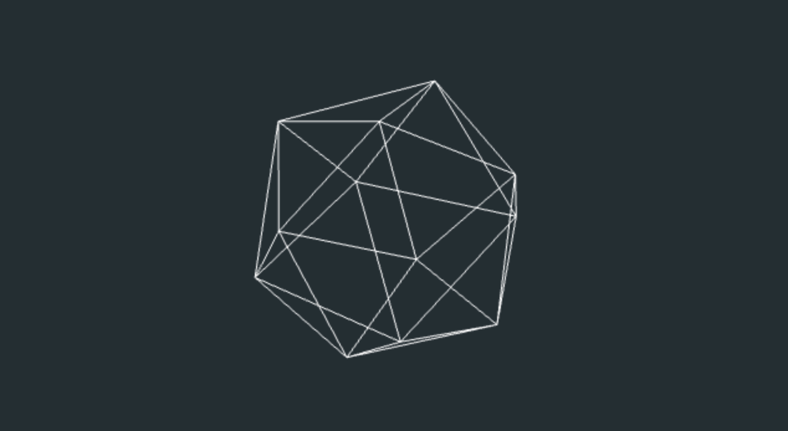
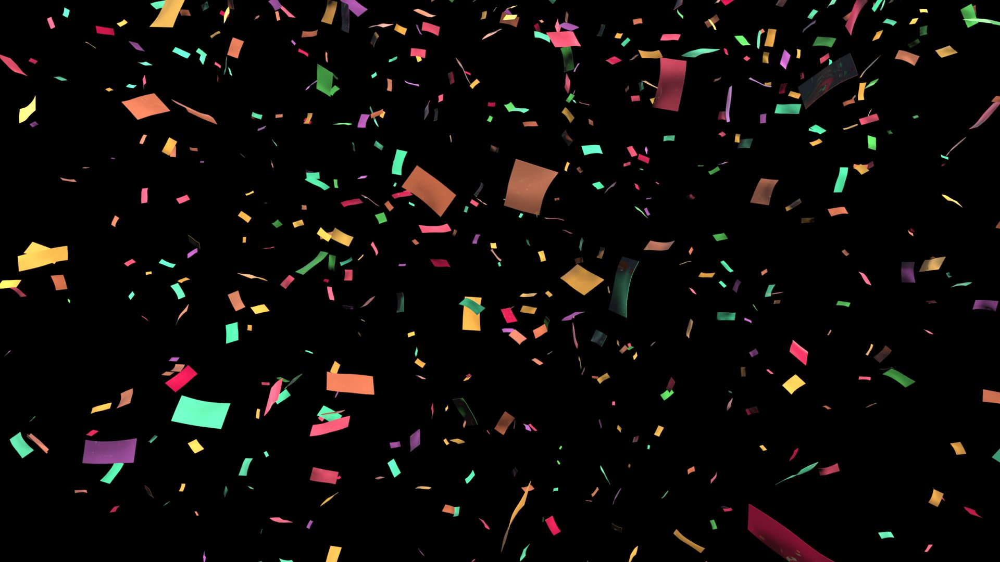

## 들어가기

노이즈는 다양한 그래픽 요소의 구현에 많이 사용하게 되는 개념이다. (개인적으로는) 특히 자연경관에 대한 묘사가 요구되는 경우에 상당히 많이 활용하게 된다.

지금껏 노이즈를 이래저래 사용해오긴 했지만, 정작 이에 대한 구현이 어떤 식으로 이루어지는지에 대한 이해가 부족한 감이 있었기에, 보다 깊은 이해를 갖추기 위한 목적으로 포스트를 작성해보려고 한다.

## 무작위성에 대해

먼저, 일반적으로 JS에서 활용하는 `Math.random`과 같은 것을 생각해보자. 이런 빌트인 함수는 보통 고유한 시드값에 기반하여 `0`과 `1` 사이의 무작위 난수를 생성한다. 대부분 이는 [메르센 트위스터](https://en.wikipedia.org/wiki/Mersenne_Twister)를 통해 구현되어 있는데, 이쪽은 또 이쪽대로 상당히 어려운 개념이기 때문에 이 포스트에서는 다루지 않겠다.

비슷한 형태로 GLSL에서는 이러한 무작위성을 나타내기 위해 `fract`와 `sin`을 사용할 수 있다. 아래는 다음의 식을 그래프로 그린 것이다.

```glsl
fract(sin(x) * 1.0);
```


위의 그림을 볼 때, 생각보다 규칙성이 눈에 띄는 형태라 이것으로 어떻게 "무작위성"을 표현한다는 것인지 의문이 들 수 있다. 무작위성은 `sin(x)`에 보다 큰 수를 곱하여 이 사인파를 무수히 많은 조각들로 쪼갤 때 드러난다. 이 경우 기존의 사인파의 형태를 예측할 수 없으며, 유사 랜덤의 형태가 된다.

```glsl
fract(sin(x) * 9999999.)
```


이를 픽셀 별로 각자의 `x`, `y`값을 갖춘 2차원의 평면에 나타내고자 할 때, 다음의 형태로 식을 변경할 수 있다. 이 경우 마치 구형 TV가 신호가 잡히지 않을 때에나 볼 수 있을 법한 노이즈의 형태를 띄게 된다.

임의의 포인트 `vec2(12.9898, 78.233)`와 현재 픽셀 좌표에 대한 내적을 구해 사용하는 것이 좀 의아하게 느껴질 수 있다. `(12.9898, 78.233)`가 시드 역할을 하고, 이와 2차원의 픽셀 좌표에 대한 내적을 구해 임의의 스칼라값으로 변환하여 사용하고자 하는 노력으로 이해해도 좋겠다.

```glsl
fract(sin(dot(vec2(x, y), vec2(12.9898, 78.233))) * 43758.5453);
```


## 노이즈

헌데 우리 실세계의 "무작위성"은 이런 TV 노이즈와 같은 형태가 아니다. 상당히 추상적으로 이야기하자면, 보다 우아하고, 부드럽다.


노이즈 알고리즘은 기존의 디지털 텍스처에 보다 자연스러운 느낌을 부여하기 위해 고안되었으며, 여기엔 몇가지 방식이 존재한다.

### 밸류 노이즈 (Value Noise)

밸류 노이즈는 임의의 값 사이에 보간을 수행하여 부드러운 형태의 텍스처를 만들어내는 방식이다.

앞서 구현했던 내용을 통해 이를 구현하기 위한 방법을 1차원적으로 살펴보면, 다음과 같다.

```glsl
float random(float x) {
  return fract(sin(x) * 9999999.);
}

float i = floor(x);
float f = fract(x);
float u = f * f * (3.0 - 2.0 * f);
float green = random(i);
float blue = random(i + 1.);
float purple = mix(green, blue, u);
```


`u`는 보간 함수로, glsl에 내장되어 있는 `smoothstep(0., 1., f)`을 사용하는 것과 결과가 동일하다. 다만 자체적으로 직접 큐빅 커브를 작성하는 경우 커스텀이 용이하기 때문에 이러한 방식이 더 선호된다.

아래 그림은 이 보간 함수의 형태를 그래프로 보여준다.

```glsl
float f = fract(x); // yellow
float u = f * f * (3.0 - 2.0 * f); // red
```



이를 2차원으로 확장하는 것 역시, 개념적으로는 동일하다.
마찬가지로 2차원 타일의 각 코너에 대한 랜덤값을 구하고, 이에 대한 보간을 수행한다.

```glsl
float random2D (in vec2 st) {
    return fract(sin(dot(st.xy, vec2(12.9898,78.233))) * 43758.5453123);
}

float noise2D(in vec2 st) {
  vec2 i = floor(st);
  vec2 f = fract(st);

  float a = random(i);
  float b = random(i + vec2(1.0, 0.0));
  float c = random(i + vec2(0.0, 1.0));
  float d = random(i + vec2(1.0, 1.0));

  vec2 u = f*f*(3.0-2.0*f);

  float x1 = mix(a, b, u.x);
  float x2 = mix(c, d, u.x);

  return mix(x1, x2, u.y);
}
```



### 그라디언트 노이즈 (Gradient Noise)

밸류 노이즈는 보간을 통해 부드러운 형태의 노이즈를 만들어내지만, 이는 여전히 픽셀 별로 (마치 블록같은) 독립적인 형태를 띄고 있다. 이러한 블록 효과를 줄이기 위해, Ken Perlin은 **Gradient Noise**라는 또다른 노이즈 알고리즘을 구현한다. 이는 단일 값이 아닌, 2차원의 벡터값을 통해 노이즈를 구현한다.

```glsl
vec2 random2D(vec2 st){
    st = vec2( dot(st,vec2(127.1,311.7)),
              dot(st,vec2(269.5,183.3)) );
    return -1.0 + 2.0*fract(sin(st)*43758.5453123);
}

float noise(vec2 st) {
    vec2 i = floor(st);
    vec2 f = fract(st);

    vec2 u = f*f*(3.0-2.0*f);
    
    float x1 = mix( dot( random2(i + vec2(0.0,0.0) ), f - vec2(0.0,0.0) ),
                     dot( random2(i + vec2(1.0,0.0) ), f - vec2(1.0,0.0) ), u.x);
    float x2 = mix( dot( random2(i + vec2(0.0,1.0) ), f - vec2(0.0,1.0) ),
                     dot( random2(i + vec2(1.0,1.0) ), f - vec2(1.0,1.0) ), u.x);

    return mix(x1, x2, u.y);
}
```


### 심플렉스 노이즈 (Simplex Noise)

사실 Perlin은 여기서 끝내지 않고, 성능적으로 더 효율적인 **Simplex Noise**를 구현한다.

기존에 사각형으로 구성된 그리드 위에 보간을 적용하는 것이 아니라, skew를 통해 그리드를 기울인 다음, `x > y`(lower triangle)인 경우와 `x < y`(upper triangle)인 경우를 각각 나누어 삼각형 그리드에 기반한 노이즈를 구현한다.

구체적인 구현을 모두 설명하기엔 꽤나 벅차서, 아래의 예제 코드로 대체하겠다.

[](https://thebookofshaders.com/edit.php#11/2d-snoise-clear.frag)

## 마치며

노이즈는 무작위성을 그래픽적으로 표현하기 위한 중요한 수단이다. [Book of Shaders](https://thebookofshaders.com/11/)에서는 물감의 안료가 어떻게 작용하는지 이해하는 화가에 빗대며, 노이즈의 구현 방식에 대해 이해한다면 보다 다양한 효과를 구현할 수 있을 것이라고 언급한다.

개인적으로도 노이즈 함수를 그대로 가져다 쓰는 경우는 많았으나, 어떻게 저 함수가 이러한 노이즈를 그려낼 수 있는지에 대해서는 그렇게 깊게 생각해본 적이 없는데, 이 기회를 통해 상세하게 알 수 있게 된 것 같아 좋았다.

## 참조

- <https://thebookofshaders.com/10/>
