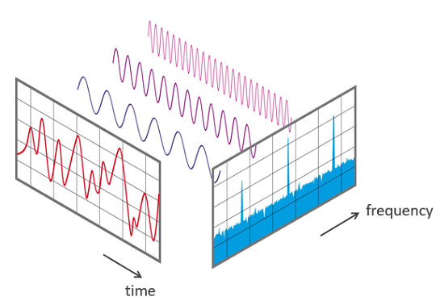

## 들어가기

프론트엔드의 관점에서, **성능**(**Performance**)은 무엇을 의미하고, 또 어떻게 측정할 수 있을까요?

프론트엔드 개발자의 입장에서 **좋은 성능**을 갖춘 웹사이트란, 단순히 리소스의 로딩 속도를 빠르다는 것 외에도, 이용자 관점에서의 좋은 경험을 제공하는 것을 의미합니다.

이에 따라 **성능 지표**(**Performance Metric**)는 개발자의 관점에서 좋은 이용자 경험을 제공하기 위해 충족해야 할 주요 목표가 됩니다.

## 근데 왜 성능 지표를 신경써야 하나요?

헌데, 왜 저 수치들을 저희가 신경써야 할까요?

실제로 저러한 성능 지표와 상관없이 우리 웹사이트는 이미 충분히 잘 동작하고 있다고 판단할 수도 있습니다.

하지만 Core Web Vitals를 비롯해 웹사이트 상에서 좋은 성능 지표를 챙겼을 때 갖는 이점이 몇 가지 존재합니다.

첫번째로, **이러한 성능 지표가 실제로 검색 노출 우선 순위를 판단하는 데에 활용된다**는 점입니다.

구글은 [21년 6월부터 순위 지정 시스템의 일부로 페이지 경험을 점차 활용하기 시작](https://developers.google.com/search/blog/2021/04/more-details-page-experience?hl=ko)했고, 지금은 [검색 노출 우선순위의 판단 요소 중 하나로 자리매김](https://www.google.com/intl/ko/search/howsearchworks/how-search-works/ranking-results/#usability) 하였습니다.

여기서 말하는 페이지 경험이란, 곧 Core Web Vitals를 비롯한 여러 성능 지표를 의미합니다.

결국, 많은 이용자들에게 자사의 웹사이트를 노출시키기 위해 Core Web Vitals는 개발자들에겐 시간을 투자하여 개선해야 할 하나의 목표가 됩니다.

두번째로, **Core Web Vitals가 실제 이용자의 웹사이트 경험과 맞닿아 있다**는 점입니다.

Core Web Vitals는 이용자 관점의 성능 지표이며, 그렇기 때문에 좋은 성능 지표를 챙긴 웹사이트의 경우 이용자들이 실제로도 더 나은 이용자 경험을 느낄 가능성이 높습니다.

프론트엔드 개발자의 입장에서는, “좋은 이용자 경험을 갖춘 웹사이트”에 대한 측정 가능한 수치적 지표를 확보하는 것이기 때문에, 웹사이트 개발에 있어 해당 성능 지표들을 지속적으로 관측하고 개선하여 좋은 이용자 경험에 대한 목표를 정의하고 달성할 수 있습니다.

## 그래서, Core Web Vitals가 뭔가요?

먼저 **Web Vitals**에 대해서 [구글은 아래와 같이 설명](https://web.dev/articles/vitals?hl=en)하고 있습니다.

> Web Vitals is an initiative by Google to provide unified guidance for quality signals that are essential to delivering a great user experience on the web.
>
> Web Vitals는 웹에서 우수한 사용자 환경을 제공하기 위해 필수적인 품질 신호에 관한 통합 지침을 제공하기 위한 Google의 이니셔티브입니다.

이를 좀 더 쉽게 풀어 이해해보면, Web Vitals는 웹에서 우수한 이용자 경험을 제공하기 위해 측정 및 개선해나가야 하는 수치이면서, 개발자들에게 구글이 제안하는 하나의 목표입니다.

Web Vitals는 다소 정의내리기 힘든 “좋은 웹사이트”에 대한 기준을 측정 가능하게, 또 단순하게 만드는 데에 그 의의가 있습니다.

그 중에서도 **Core Web Vitals**는, Web Vitals 내에서도 가장 핵심적인 몇가지 지표들을 추려낸 것으로, 여러 성능 지표 안에서도 가장 중요하게 판단되는 해당 지표들을 개선하는 데에 개발자들이 집중할 수 있도록 도와줍니다.

아래에서는 현재 시점에서 Core Web Vitals에 포함되는 지표들을 간단하게 살펴보도록 하겠습니다.

### Largest Contentful Paint (LCP)

**LCP**는 사용자가 웹 페이지를 처음으로 이동한 시점을 기준으로, **가장 큰 이미지 또는 텍스트 블록이 렌더링되기까지 걸리는 시간을 측정**하는 지표입니다.

LCP가 측정하고자 하는 것은 이용자 관점에서의 로딩(Loading) 성능입니다. 즉, 실제 이용자가 느끼기에 로딩이 완료되었다고 판단하는 기준점으로 LCP가 활용됩니다.

이전에는 페이지 로딩 성능에 대한 측정을 할 때, `load`, `DOMContentLoaded`와 같은 이벤트를 사용했으나, 이것이 실제로 "사용자의 화면에 무엇인가 표시됨"을 의미하는 것과는 거리가 멀었다는 점에서 착안된 지표입니다.

이와 유사한 FCP(First Contentful Paint) 역시 사용자 중심의 로딩 성능 측정을 위한 것이지만, 페이지 로드 시 실제 컨텐츠와 관련없이 등장하는 **스피너** 또는 **스플래시 스크린**이 활용되는 웹 사이트의 경우 실제 이용자가 로딩이 완료되었다고 느끼기 어렵다는 문제가 있어 이에 대한 대체로 LCP를 활용됩니다.

실제로 위 예시 이미지에서 살펴볼 수 있는 것처럼, 일반적인 경우라면 LCP는 FCP보다 이후의 시점으로 측정됩니다.

### Cumulative Layout Shift (CLS)

**CLS**는 사용자가 웹 페이지를 처음으로 이동한 시점을 기준으로, **화면에 보이는 요소들이 얼마나 불안정하게 움직이는지를 측정**하는 지표입니다.

CLS는 **시각적 안정성**(Visual Stability)을 측정하는 중요한 사용자 중심 측정항목입니다.

여기서 말하는 시각적 안정성이 부족한 경우에 발생하는 문제에 대해 잘 보여주는 간단한 동영상이 하나 있습니다.

이러한 시각적 불안정성은 비동기적인 리소스 및 DOM 요소가 기존 웹사이트의 컨텐츠 위에 동적으로 추가되면서 페이지 컨텐츠가 예상치 못하게 이동하면서 발생합니다.

시각적 안정성에 대한 최적화는 다소 다루기 어려울 수 있는데, 일반적으로는 개발 단계에서 사이트가 동작하는 방식과 프로덕션 빌드가 이루어진 웹 사이트가 동작하는 방식 사이에 차이가 있기 때문입니다.

CLS는 이런 점에서 실제 이용자들에게 레이아웃 이동이 얼마나 잦은 빈도로 발생하는 지에 대해 측정하여 문제를 해결하는 데에 도움을 줍니다.

### First Input Delay (FID)

**FID**는 **사용자가 웹 페이지와 처음으로 상호작용을 한 시점과 브라우저가 해당 인터랙션에 대한 반응으로 이벤트 핸들러를 실제로 호출 가능해지는 시점까지 걸리는 시간을 측정하는 지표**입니다.

FID는 이용자 관점에서 느끼는 상호작용(Interactivity)에 대한 측정 지표가 됩니다.

일반적으로 입력 지연(Input Delay)은 브라우저의 메인 스레드가 다른 작업을 처리하느라 바빠서 사용자 입력에 대한 응답을 처리할 수 없기 때문에 발생합니다.

그 이유 중 하나는 브라우저가 앱에서 로드한 대용량의 JS 파일을 파싱하고 실행하느라 바쁜 경우입니다. 이 때는 로드 중인 JS가 다른 작업을 수행할 수 있기 때문에, 이벤트 리스너를 실행할 수 없도록 브라우저 상에서 처리됩니다.

위는 FID 측정 시나리오의 한 예시입니다. FCP가 이루어지고 나서, 우연하게 브라우저의 메인 스레드가 바쁜 시점(금색)에 이용자가 클릭 등의 상호작용을 한 경우, 브라우저는 메인 스레드의 작업이 처리되고 나서야 이용자의 상호작용에 반응할 수 있습니다. FID가 길게 발생하는 때는 이러한 경우입니다.

재미있게도, **FID는 이용자가 언제 상호작용했느냐**에 따라 크게 영향을 받는 측정 항목입니다.

이를테면 이용자가 위의 예시보다 훨씬 더 빨리 상호작용을 해서 브라우저의 메인 스레드가 바쁜 시점을 피했다면 FID는 발생하지 않았을지도 모릅니다.

이는 결국, 여러 이용자들 중 하나의 FID 값만을 관측하는 것은 해당 지표를 활용하는 데에 있어 부적절하다는 결론으로 이어집니다. 다른 지표들도 마찬가지이지만, 성능 지표를 살펴볼 때는 전체적인 분포를 기준으로 판단하는 것이 필요합니다.

### Interaction to Next Paint (INP)

**INP**는 사실 현 시점(24년 1월) 기준으로는 Core Web Vitals에 포함되지 않습니다. 하지만 INP는 빠른 시일 내인 24년 3월에 **FID**를 대체하여 Core Web Vital에 정식으로 포함될 측정 항목이기 때문에, 해당 섹션에서 추가로 설명하기로 했습니다.

**INP**는 **사용자가 페이지를 방문한 동안에 발생하는 모든 클릭 / 탭 / 키보드 상호작용의 지연시간을 관찰하여 사용자 상호작용에 대한 페이지 전반적인 응답성을 평가하는 지표**입니다. 최종적인 INP 값은 이상치(outlier)를 제외하고 관찰한 가장 긴 상호작용에 해당합니다.

여기서 말하는 **상호작용**(= interaction)이란, 동일한 사용자 제스처 중에 실행되는 여러 이벤트 핸들러의 묶음입니다. 예를 들어 터치스크린 디바이스의 경우에는 탭 한번에 `pointerup`, `pointerdown`, `click`과 같은 여러 이벤트가 포함됩니다.

그리고 상호작용의 지연시간(= latency)란, 이용자가 상호작용을 시작한 시점에서부터 그 다음 프레임에 시각적 프레임이 표시되는 순간까지의 상호작용을 구동하는 이벤트 핸들러 그룹 중 가장 긴 단일 시간에 해당됩니다.

이에 대한 내용은 말로 설명했을 때 이해하기 어려울 수 있습니다.

위의 그림을 통해 살펴볼 때, 아래와 같은 흐름이 발생합니다.

- 메인 스레드가 처리 중인 장기 작업이 있는 상황에서 이용자 입력이 발생
- 이벤트 핸들러 그룹이 실행
- 렌더 / 페인트 / 컴포지션이 순서대로 실행
- 그 이후 프레임이 표시

위 흐름에서, 이용자 입력이 발생하고 결국 마지막에 이용자가 확인할 수 있는 프레임이 표시되는 그 사이의 시간을 측정한 것이 바로 상호작용의 지연시간입니다.

앞서 측정한 지연시간들은 사용자가 입력을 할 때마다 여러 번 측정될 수 있으며, **INP는 이렇게 여러 번 측정된 상호작용 지연시간 중 가장 긴 값이 됩니다**.

여기서 알 수 있는 INP가 다소 특이한 점은 바로 사용자가 페이지를 떠나는 시점에 비로소 계산된다는 것입니다.

INP가 FID와 다른 점은, **INP가 페이지 내의 모든 상호작용은 고려**하는 반면, **FID는 첫번째 상호작용만을 고려**한다는 것입니다. 또한 **FID는 첫번째 상호작용의 입력 지연 그 자체만을 고려**하기 때문에 실질적인 이벤트 핸들러 실행 시간이나 다음 프레임의 표시 시간에는 크게 관심이 없다는 점에서 차이가 있습니다.

## Core Web Vitals의 측정 방법

Core Web Vital을 개선하기 위한 그 첫 단계로는, 먼저 사이트가 현재 지닌 Core Web Vital에 대해 측정하는 것입니다.

이 성능 지표들을 파악하는 방법에는 여러가지 방법이 존재하지만, 수집하여 활용하는 데이터에 따라 크게 두가지로 나누어 볼 수 있습니다.

### RUM 데이터를 활용한 측정

먼저, [**RUM**(Real User Monitoring)](https://en.wikipedia.org/wiki/Real_user_monitoring) 데이터는 필드 데이터(Field Data)라고도 불리며, **실제 이용자가 경험하는 성능**에 대해 측정합니다.

Google에서도 이 RUM 데이터를 통해 해당 사이트가 권장되는 Web Vital의 기준점을 충족하고 있는지 여부에 대해 판단하고 있습니다.

RUM 데이터를 수집하는 대표적인 방법은 [**PageSpeed Insights**(PSI)](https://pagespeed.web.dev/?hl=ko)를 활용하는 것입니다. PageSpeed Insights를 사용하면 지난 4주 간 집계된 페이지의 성능 관점의 실적과, 그 개선 방법에 대한 제안도 함꼐 제공됩니다. 당장에 Web Core Vitals에 대한 개선을 시작하기에 좋은 출발점이 됩니다.

이 밖에도 [**Search Console**](https://search.google.com/search-console/welcome?hl=ko)을 활용하거나, [**CrUX 대시보드**](https://developers.google.com/web/updates/2018/08/chrome-ux-report-dashboard?hl=ko)를 활용하는 것 역시 RUM 데이터에 기반한 것입니다.

세 가지 방식 모두 실제 이용자들이 경험하는 성능에 대해 파악할 수 있는 방법들이지만, 적용 사례에 따라 가장 적절한 방법을 선택하는 것이 필요합니다.

### Lab 데이터를 활용한 측정

Lab 데이터는 합성 데이터(Synthetic Data)라고도 불리며, 실제 이용자가 아닌 통제된 환경에 기반하여 수집됩니다.

RUM 데이터와는 다르게 Lab 데이터는 실제 프로덕션 환경이 아닌 경우에도 수집할 수 있기 때문에, 개발자 워크플로 내지는 CI 프로세스에 통합할 수 있습니다.

이러한 방식에는 Chrome의 [Web Vital 확장 프로그램](https://github.com/GoogleChrome/web-vitals-extension)을 활용하거나, 개발자 도구 내에서도 제공되는 Lighthouse를 활용하거나, [WebPageTest](https://www.webpagetest.org/) 웹사이트를 활용하는 방법이 있습니다.

그 중에서도  **Lighthouse**는 앞서 말한대로 개발자 도구에서 제공될 뿐만 아니라, Chrome 확장 프로그램, npm 패키지, [CI](https://github.com/GoogleChrome/lighthouse-ci)로도 제공되기 때문에 다양한 경우에 활용할 수 있습니다.

주의해야 할 점은, RUM 데이터와 Lab 데이터 간에는 항상 불일치가 발생한다는 점입니다. 특히 네트워크 조건, 기기 유형 또는 실험 환경의 위치가 실제 사용자의 데이터와 큰 차이가 있는 경우 더욱 그렇습니다.

특히, 대부분의 Lab 데이터 기반의 성능 측정 도구들은 일반적으로 페이지 로드만 수행할 뿐, 별도로 상호작용을 수행하지 않는다는 점에서 CLS, FID와 같이 이용자의 상호작용에 의존적인 일부 성능 지표에서 주요한 차이가 발생합니다.

이 부분에서 요구되는 고려사항에 대해 보다 구체적으로 파악하고 싶다면 [이 쪽의 아티클](https://web.dev/articles/vitals-measurement-getting-started#considerations)을 참조하시길 바랍니다.

## Core Web Vitals 개선하기

### Largest Contentful Paint (LCP) 최적화

LCP는 말 그대로 가장 큰 컨텐츠가 화면에 그려지기까지에 걸리는 시간을 의미합니다.

하지만 브라우저의 관점에서, 이는 단순히 그리기 작업을 수행하는 것만 의미하지는 않습니다.

LCP는 아래의 그림처럼 크게 4가지 부분으로 나누어 볼 수 있습니다.

- TTFB, 이용자 페이지 로드의 시작 이후 브라우저가 HTML 문서 응답의 첫 바이트를 수신할 때까지의 시간
- 리소스 로드의 지연
- 리소스 로드 자체에 걸리는 시간
- 요소 렌더링의 지연

LCP 최적화에 있어 중요한 점은 LCP 시간을 이처럼 네가지 구간으로 나누어 각각에 대한 최적화를 모두 진행해야 한다는 것입니다. 단순히 한 부분에 최적화를 적용한다고 해서 LCP가 개선되지 않는 경우도 있습니다.

예를 들어, 위의 그림에서 이미지를 WebP 포맷으로 변환하여 이미지 파일 크기 자체를 줄이는 경우, **리소스 로드 시간** 자체는 줄어들지만, 그 시간이 그대로 **요소 렌더링 지연**으로 옮겨가기 때문에 실질적인 LCP는 개선되지 않습니다. (WebP를 렌더링하는 것은 일반적인 포맷보다 더 많은 리소스가 요구되어 그 만큼 렌더링에 소요되는 시간이 늘어나기 때문입니다.)

위의 네가지 구간에서, **이상적인 경우** LCP에서 많은 비율을 차지하는 것은 초기 문서 로딩(#1)와 리소스 로딩(#3)이어야 합니다.

다시 말해, 나머지 둘(#2, #4)은 지연(Delay)라는 이름에서 알 수 있듯 애초에 0에 가까운 값이 되도록 최적화하는 것이 필요합니다.

### Cumulative Layout Shift (CLS) 최적화

CLS를 최적화할 때 유의해야 할 것은 해당 성능 지표가 이용자들의 상호작용에 따른 영향을 받는다는 점입니다.

CLS는 이용자의 상호작용 직후 500ms 이내에 포함되지 않는 뷰포트 내 모든 레이아웃 변경의 정도를 점수로 계산하여 그 합을 계산합니다.

앞서 말한 것처럼 RUM 데이터 기반인지, Lab 데이터 기반인지에 따라, 측정되는 CLS에 유의미한 차이가 있을 수 있습니다.

이 때, 만약 각 데이터를 기반하여 측정한 CLS 점수에 차이가 존재하고, 그 중에서도 RUM 데이터를 기반으로 측정한 CLS 점수가 나쁘다면 페이지 로드 이후 이용자의 상호작용에 따라 페이지 수명 내에 추가적으로 발생하는 CLS가 그 원인일 수 있습니다.

일반적으로 CLS를 일으키는 주된 원인은 아래와 같은 것들이기 때문에, 웹 사이트에 아래와 같은 내용이 포함되어 있지는 않은지에 대해 파악하고, 적절한 방법으로 대처하는 것이 필요합니다.

- 크기 및 비율을 미리 정의하지 않은 이미지 (`width`, `height` / `aspect-ratio`)
- 광고, 위젯 등 늦은 시점에 로드되는 컨텐츠
- `top`, `left`, `box-shadow`, `box-sizing` 등에 의존하여 re-layout(=reflow)를 일으키는 애니메이션
- 웹 폰트 (FOUT, FOIT)

### First Input Delay (FID) 최적화

FID의 주된 원인은 **무거운 JS 작업의 실행**입니다.

브라우저는 메인 스레드에서 JS가 실행되는 동안에는 대부분의 사용자 입력에 응답할 수 없기 때문입니다.

JS가 웹페이지에서 파싱, 컴파일, 실행되는 방식을 최적화 하면 FID는 직접적으로 줄어듭니다.

FID는 실제로 이용자가 상호작용을 시작해야만 측정이 가능한 지표이기 때문에, Lab 데이터 기반의 측정 도구를 사용하는 경우 **TBT**(**Total Blocking Time**)을 통해 실사용자들로부터 측정될 FID를 예측할 수 있습니다.

> TBT는 컨텐츠가 처음으로 그려지기 시작한 이후 메인 스레드가 차단되는 총 시간을 측정합니다.

먼저, 오래 걸리는 작업들은 더 작은 비동기 작업들로 나누거나, Web Worker를 통해 백그라운드 스레드를 활용하도록 할 수 있습니다.

소요 시간이 긴 작업들은 개발자 도구 상에서도 파악할 수 있습니다.

또, JS 코드 자체를 최적화하는 것 역시 주요한 과제입니다. 더 구체적으로는 아래와 같은 내용들을 고려할 수 있습니다.

- 코드 스플리팅
- 트리 셰이킹
- 사용하지 않는 폴리필 최소화하기
- `async` 또는 `defer`를 사용해 우선 순위가 낮은 서드파티 JS의 실행 늦추기

### Interaction to Next Paint (INP) 최적화

INP는 사용자가 페이지를 방문하고 난 이후 내내 발생하는 모든 상호작용에서 발생하는 지연 시간을 관찰하여 페이지 전반적인 응답성을 평가하는 지표입니다.

단순 텍스트 및 이미지가 전부인 웹사이트에서 이러한 상호작용은 전혀 발생하지 않을 수도 있는 반면, 게임과 같은 웹사이트의 경우 수백, 수천개의 상호작용이 발생할 수도 있습니다.

INP 최적화는 RUM 데이터에 기반하여 실제 이용자들이 어떤 페이지에서 어떤 상호작용 유형(클릭 / 탭 / 키)을 일으켰는지 등 여러 문맥을 파악하여 너무 큰 INP를 갖게 되는 특정한 상황에 대해 판단하는 것이 필요합니다.

이후 실제로 상호작용이 느리다는 것을 파악하고 나서는 개발 환경에서 이를 수동으로 재현하고 이를 최적화하는 과정이 이루어져야 합니다. 아래 세 단계의 합은 곧 상호작용의 지연 시간이 되며, 각 단계에서의 지연 시간을 최적화할 방법을 찾는 것이 필요합니다.

1. 입력 지연 → 사용자가 상호작용을 시작한 이후 이벤트 핸들러가 실행되기 전까지
2. 처리 시간 → 이벤트 핸들러 자체의 실행 시간
3. 프레젠테이션 지연 → 상호작용의 시각적 결과를 브라우저가 다음 프레임으로 표시하는 데 걸리는 시간

이를 최적화 과정에는 여러가지가 있겠지만, 중요 포인트는 이용자의 상호작용 이후 최대한 빠르게 시각적인 피드백을 제공해야한다는 것입니다.

이를테면, 사용자가 데이터 불러오기를 요청하는 버튼을 클릭했을때, 실제로 데이터 불러오기 작업을 모두 수행하고 나서야 가져온 데이터를 보여주기보다는, 스켈레톤 또는 스피너 UI를 활용해서 **무엇인가 일어나고 있음**을 시각적 피드백으로 곧바로 전달해주는 것이 필요합니다.

앞서 말한 각 성능 지표에 대한 세부적인 최적화 방안에 대해서는 [web.dev](https://web.dev/?hl=ko)의 여러 아티클에서 다루어지고 있습니다. 실제로 각 성능 지표의 구체적인 최적화 방안에 대해 살펴보고 싶다면 아래의 아티클들을 추가로 살펴보시는 것을 추천드립니다.

- [LCP 최적화](https://web.dev/articles/optimize-lcp?hl=ko)
- [CLS 최적화](https://web.dev/articles/optimize-cls?hl=ko)
- [FID 최적화](https://web.dev/articles/optimize-fid?hl=ko)
- [INP 최적화](https://web.dev/articles/optimize-inp?hl=ko)

## 마치며

이번에 Web Core Vitals 그 자체, 또 그것을 이루는 각 항목에 대해 세부적으로 살펴봄에 따라 프론트엔드 관점에서의 성능 최적화에 대해 한층 더 높은 이해도를 얻을 수 있어 정말 좋았습니다.

해당 글의 거의 모든 내용은 [web.dev](https://web.dev/)의 아티클들을 참고하여 작성되었습니다.

여기서 제공되는 아티클들을 더 간단한 문장으로 풀어쓰고, 간추린 것에 가깝기 때문에, 이 포스트에서 다룬 내용보다 훨씬 더 깊은 이해를 갖기를 원하신다면 [web.dev](https://web.dev/) 내 각 아티클들을 하나씩 직접 읽어보시는 것을 추천드립니다.

짧게 간추렸다고 생각했지만, 여전히 긴 글을 읽어주심에 감사드립니다. :)
