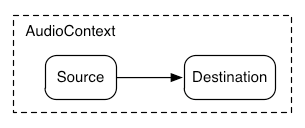

## 들어가기

최근 실시간 렌더링에 대한 관련 책을 하나 읽고 있다.
다만, 이론적인 내용을 오직 글로만 학습하는 것은 제법 따분한 일이다.
단순히 읽기만 해서는 좀처럼 흥미가 잘 생기지 않아서, 실제 구현 결과는 어떤 식으로 나타나는지 호기심이 생겨 간단한 실습을 해보기로 했다.
이번 포스트에서 다룰 것은 Gooch 셰이딩에 기반한 형태의 간단한 셰이딩 모델의 구현이다.

## Gooch 셰이딩

[**Gooch 셰이딩**](https://en.wikipedia.org/wiki/Gooch_shading)은 비사실주의 렌더링의 하나로, **cool to warm 셰이딩**으로도 알려져 있다. Gooch 셰이딩이라는 이름 자체는 [Amy Gooch](https://en.wikipedia.org/wiki/Amy_Ashurst_Gooch)에 의해 개발되었기 때문이다. (사진 출처 - Wikipedia)


Gooch 셰이딩은 크게 두 가지의 색상을 사용하는데, 이는 각각 Warm과 Cool로, warm(ex. 노란색)은 광원을 향하는 표면을 나타내고, cool(ex. 파란색)은 그 반대쪽을 향하는 표면을 나타낸다.

보통 두번의 패스에 걸쳐 그려지는 경우가 많은데, 위의 그림에서 볼 수 있듯, 먼저 cool to warm 셰이딩을 수행한 후, 검은 색의 외곽선을 그려주는 것이 그 예다.

## 셰이딩 모델 정의

이번 포스트에서 구현할 셰이딩 모델은, Gooch 셰이딩과 유사하지만, 다중 광원에 대해 동작이 가능하도록 수정된 형태이다. (비록 여기서는 하나의 광원만을 사용하더라도)

> 사실은, `uint` 유니폼을 활용하여 실제로 여러 개의 광원을 넣을 수 있는 형태로 구현을 하려 했는데, 생각대로 되지 않아 궁금한 맘에 [포럼에 질문을 올렸다](https://forum.babylonjs.com/t/cannot-use-uint-uniforms-in-shadermaterial/43998). 알고보니 `ShaderMaterial`의 `uint` 유니폼 설정과 관련한 버그가 있었고, 그걸 어쩌다 내가 찾았던 모양이다. 직접 PR을 올린건 아니지만, 이슈를 발견함에 따라 간접적으로 라이브러리에 기여했다는 생각에 뿌듯한 경험이었다.

먼저 여기서 사용될 각 벡터에 대해서는 아래의 그림이 이해를 도울 것이다.


여러 개의 광원이 적용된 기초 셰이딩 모델의 수식은 다음과 같은 형태가 된다.

$$
c_{shaded} = f_{unlit}(n,v) + \sum_{i=1}^{n}(l_{i} \cdot n)^{+}c_{light_i}f_{lit}(l_{i},n,v)
$$

단, 이번 구현에서는 편의 상 여러 개의 광원을 두지 않고, 단 하나의 광원으로 처리한다. 따라서, 아래와 같이 단순화할 수 있다.

$$
c_{shaded} = f_{unlit}(n,v) + (l \cdot n)^{+}c_{light}f_{lit}(l,n,v)
$$

여기서, Gooch 모델과 유사한 형태로 보이기 위해 다음과 같이 lit과 unlit 항을 둔다.

$$
f_{unlit}(n,v)=\frac{1}{2} c_{cool}
$$
$$
f_{lit}(l, n, v) = s \cdot c_{highlight} + (1 - s)c_{warm}
$$

여기에, 다음과 같은 중간 계산 과정이 추가된다.

$$
c_{cool} = (0,0,0.55) + 0.25c_{surface}
$$
$$
c_{warm} = (0.3,0.3,0) + 0.25c_{surface}
$$
$$
c_{highlight} = (2,2,2)
$$
$$
r = 2(n \cdot l)n - l
$$
$$
s = (100(r\cdot v) - 97)^\mp
$$

## 구현해보기

구현에 있어서는 BabylonJS의 ShaderMaterial을 사용했고, 셰이더를 적용할 메쉬로는 수잔을 사용했다.
BabylonJS에 관련된 코드는 이 포스트에서 중점적으로 다루고 싶은 바가 아니므로 생략하고 셰이더 코드와 관련된 부분들만 다루고자 한다.

### 버텍스 셰이더

버텍스 셰이더에서는 정점의 위치와 법선을 전역 공간으로 변환하여 각각 `vPosition`과 `vNormal`이라는 이름으로 프래그먼트 셰이더에 넘긴다. 또한 정점을 클립 공간으로 변환하여 `gl_Position`으로 넘겨준다. BabylonJS에서는 빌트인 유니폼으로 `world`, `worldViewProjection` 등을 제공하므로, 작성에 큰 어려움이 없다.

```GLSL
#version 300 es
precision highp float;

in vec3 position;
in vec3 normal;

uniform mat4 world;
uniform mat4 worldViewProjection;

out vec3 vPosition;
out vec3 vNormal;

void main(){
  vPosition=mat3(world)*position;
  vNormal=mat3(world)*normal;
  gl_Position=worldViewProjection*vec4(position,1.);
}
```

이렇게 넘긴 `vPosition`과 `vNormal`은 보간되며, 전역 좌표계와 함께 컬러를 통해 확인해보면 아래와 같다.

바로 아래는 `vPosition`이고,


그 아래는 `vNormal`이다.



### 프래그먼트 셰이더

여기서 식을 다시 살펴보자.

$$
c_{shaded} = f_{unlit}(n,v) + (l \cdot n)^{+}c_{light}f_{lit}(l,n,v)
$$

먼저, 빛을 받지 못하는 부분인 $f_{unlit}$ 에 대한 구현을 먼저 수행할 것이다. 아래의 중간 계산을 처리해주면 된다.

$$
f_{unlit}(n,v)=\frac{1}{2} c_{cool}
$$

$$
c_{cool} = (0,0,0.55) + 0.25c_{surface}
$$

위의 식에는 $n, v$ 가 매개변수로서 들어있지만, 실제로 사용되지는 않으므로 코드 작성에서는 제외한다.

```GLSL
// ...

uniform vec3 coolColor;
uniform vec3 surfaceColor;

// ...

vec3 unlit(){
  vec3 c=coolColor+.25*surfaceColor;
  return c*.5;
}
```

다음으로, 빛을 받는 부분인 $f_{lit}$ 에 대한 구현을 수행한다. 아래의 중간 계산을 처리해주면 된다.

$$
f_{lit}(l, n, v) = s \cdot c_{highlight} + (1 - s)c_{warm}
$$
$$
c_{warm} = (0.3,0.3,0) + 0.25c_{surface}
$$
$$
c_{highlight} = (2,2,2)
$$
$$
r = 2(n \cdot l)n - l
$$
$$
s = (100(r\cdot v) - 97)^\mp
$$

```GLSL
// ...

uniform vec3 warmColor;
uniform vec3 surfaceColor;
uniform vec3 highlightColor;

vec3 lit(vec3 l,vec3 n,vec3 v){
  vec3 rl=reflect(-l,n);
  vec3 c=warmColor+.25*surfaceColor;
  float s=clamp(100.*dot(rl,v)-97.,0.,1.);
  return mix(c,highlightColor,s);
}
```

여기서, `reflect(i, n)`는 입사 벡터의 반사 벡터를 구하는 계산식인 `i - 2.0 * dot(n, i) * n`을 처리해주는 빌트인 함수다. 단, 여기서 코드 내 `l`은 입사 벡터가 아닌, 광원 쪽을 향하는 방향 벡터이므로, 이에 대한 역(`-l`)을 취해주어야 한다는 점에 주의할 필요가 있다.

`s`는 하이라이트 혼합 계수를 구하는 것으로, 반사광 `rl`과 관측 벡터 `v`의 내적을 통해 두 벡터 간의 서로 정렬되는 정도를 구하여 이를 적절히 활용하며, 그 결과를 `0` ~ `1` 사이의 값으로 클램핑해준다.

이제 나머지는 이렇게 만든 각 함수를 통해 아래의 완전한 식을 계산해주기만 하면 된다.

$$
c_{shaded} = f_{unlit}(n,v) + (l \cdot n)^{+}c_{light}f_{lit}(l,n,v)
$$

```GLSL
// ...

uniform vec3 cameraPosition;
uniform vec3 lightPosition;
uniform vec3 lightColor;

// ...

in vec3 vPosition;
in vec3 vNormal;

out vec4 outColor;

void main(){
  vec3 unlitColor=unlit();
  outColor=vec4(unlitColor,1.);
  vec3 n=normalize(vNormal);
  vec3 v=normalize(cameraPosition-vPosition);
  vec3 l=normalize(lightPosition-vPosition);
  float dl=clamp(dot(n,l),0.,1.);
  outColor.rgb+=dl*lightColor*lit(l,n,v);
}
```

## 구현 결과

<iframe
  id="GoochLikeShading"
  title="GoochLikeShading"
  width="800"
  height="600"
  style="margin:0 auto; max-width: 100%;"
  src="https://shubidumdu.github.io/sketchbook/pages/gooch-like/"
>
</iframe><br>

## 마치며

따분하게 느껴졌던 이론을 실제로 적용해보고 구현하는 일련의 경험은 언제나 즐겁다. 이번 포스트에서는 Gooch 셰이딩과 유사한 형태의 간단한 셰이딩 모델을 구현해보았고, 기본적인 셰이딩 모델을 구현하는 방식에 대한 이해를 높일 수 있었다.
