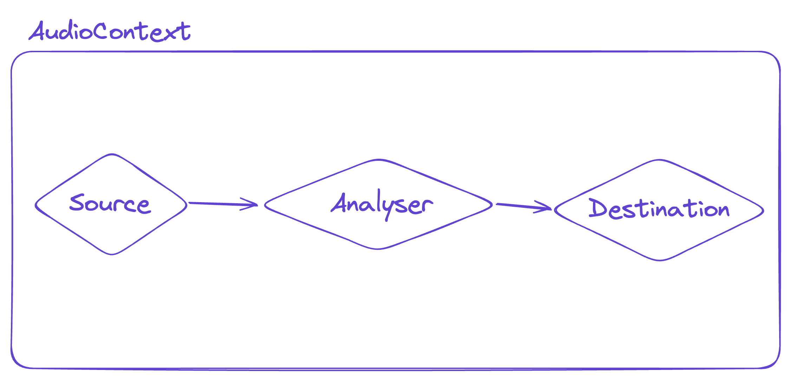

## 들어가기

여러 사이트의 WebGL 작업물들을 살펴보다가, 문득 그런 생각이 들었다.

`이렇게 모델들이 대놓고 노출되어도 문제 없는건가..?`

이를테면 내가 했던 프로젝트에 포함된 메쉬들도, 모델을 가져다 쓰기 위해 `.glb` 파일을 브라우저 상에서 가져오기 위해 요청을 보내고 있다.

비단 내 프로젝트 뿐만 아니라, [ThreeJS Examples](https://threejs.org/)에 있는, 모델을 가져다 사용하는 거의 모든 프로젝트들이  `.glb` 내지는 `.gltf`로 에셋 요청을 주고받으며 사용하고 있다.

보다시피 저렇게 모델의 요청 URL이 버젓이 노출되어 있다는 것은 말 그대로 `누구나 이걸 다운로드 받아 2차 창작을 가할 수 있다`는 뜻인데, 이게 과연 문제가 없을까? 라는 것이다.

임의의 ThreeJS 프로젝트에서 소스 URL을 찾아 이를 다운로드 받고, 직접 블렌더로 가져와 확인해봤는데 실제로도 2차 창작에 아무런 문제가 없는 수준이었다.

아마 모델에 들인 노고가 많을수록, 또 해당 모델에 대한 인지도 자체가 높을수록 이는 상당히 큰 문제가 될 수 있는 부분이다.

기업의 경우 3D 컨텐츠 제작을 위한 모델링 비용에 적지 않은 비용을 들일 것인데, 결국 이것을 누구나 가져다 쓸 수 있다면, 무엇하러 그 노력을 들이려고 하겠는가?

## GLTF/GLB가 뭐길래?

`glTF`는 [Khronos Group](https://www.khronos.org/)에 의해 디자인 및 정의된 것으로, **네트워크를 통한 3D 컨텐츠의 효율적인 전송**을 위한 것이다. `glTF`의 코어는 JSON 파일이고, 3D 모델들을 포함하여 하나의 씬 구조 및 구성을 나타낸다.

모든 에셋을 하나의 단일 `glTF` 파일에 저장하는 것이 가능하고, 이게 바로 `glb`이다. 이 때, JSON 데이터는 버퍼 내지는 이미지의 바이너리 데이터에 해당하는 문자열로 변환 및 저장된다.

보통 대부분의 경우 `glb`가 더 선호되는데, 다음과 같은 이유에서다.

1. 바이너리 포맷이라서 용량 측면에서 더 컴팩트하다.
2. 단일 파일이라 요청해야 하는 파일 수 자체가 적다.

여러가지 파일 포맷들에 대한 이야기도 다루고 싶지만, 이는 나중에 별도의 포스트로 다루는 게 좋겠다!

결국 중요한 것은 해당 파일을 보유한 경우 온전히 그 모델을 사용할 수 있게 된다는 점이다.

## Sketchfab은 어떻게 처리하고 있을까?

사실 제일 먼저 떠오른 것이 `그럼 Sketchfab은 어떻게 하고 있지?` 였다.

[Sketchfab](https://sketchfab.com/)은 애초에 수많은 3D 모델에 대한 구매/판매를 지원해주는 서비스인데, 웹 뷰어에 표시되는 모델을 따로 돈 줄 필요도 없이 그대로 다운받을 수 있는 상황이라면 서비스의 의미 자체가 사라져버리는 것이다.

그런데 문제 없이 운영을 하고 있다는 것은, 나름의 안전 장치가 있다는 건데, 그게 무엇인지 궁금했다.

살펴보니, 실제로 Sketchfab은 `.glb`가 아닌, `.binz`라는 별도의 파일 포맷을 사용하고 있다.

[Sketchfab의 고객 센터에 따르면](https://help.sketchfab.com/hc/en-us/articles/202484576-Model-Security), 실제로 이 부분에 각별히 신경을 쓰고 있는 것처럼 보인다. 뷰어를 통해 제공되는 데이터는 손실 알고리즘(lossy algorithm)을 통해 압축되어 있으며, 이에 따라 원본 파일을 가져다 쓸 수는 없다고 한다.

그 밖에 3D 데이터에 무단으로 액세스하려고 하거나, Sketchfab의 컨텐츠를 리버스 엔지니어링 하려는 시도를 약관 상 엄격히 금지하고 있다.

물론 모델을 완전히 보호할 수 있는 것은 아니다. 기본적으로 만들어진 모델링이 활용될 때에 비디오 카드로 전송되어, 이 시점에서 데이터는 읽을 수 있는 상태가 되기 때문에 이를 가로채서 사용할 수 있기 때문이다. (실제로 그런 용도의 툴이 존재하며, 악용을 막기 위해 굳이 이름을 언급하지는 않으려고 한다.) 그럼에도 원본 모델 자체는 이용자가 모델을 구매하거나 해서 다운로드를 활성화시키지 않는 한 절대 노출되지 않는다고 보장하고 있다.

이 `binz` 포맷은 Sketchfab에서 자체적으로 사용하는 것처럼 보이며, Sketchfab의 모델을 가져다 사용하기 위한 툴인 [SFTool의 설명에 따르면](https://github.com/oxmaulmike2581/SFTool)(지금은 아카이빙 상태) GZip 압축 대신 기존의 OSGJS 및 BIN 파일 위에 암호화 계층이 추가된 것이라고 한다. 이에 대한 디코딩은 외부에서 아직 어려운 것 같다.

(Sketchfab이 이 문제를 다루는 방식에 대해 더 구체적인 이해가 생긴다면 추가로 포스트를 수정하겠다. 아직은 "어려워보이는 단어"에 의존하고 있는 부분에 대한 양해를 구한다.)

## 대안

Sketchfab은 독자적으로 포맷을 구축하여 이를 인코딩/디코딩하는 방식으로 사용하고 있다. 아마도 Sketchfab이 굳이 이에 대한 내부적인 사항을 공개하지 않는 이상, Sketchfab의 방식을 완전히 똑같이 적용하기는 쉽지 않을 것이다.

사실 이 고민은 나만 했던 것이 아니다. 이미 많은 이들이 이 문제에 대해 인식하고 있지만, 현재로서 완벽한 대안은 없다고 판단된다. 웹의 수많은 이미지와 동영상들이 저작권 문제에서 자유로울 수 없듯이, 3D 모델에 대해서도 이는 마찬가지다.

그래도 최대한 우리가 할 수 있는 최선을 찾아보자면, 그나마 유의미한(적어도, 모델 도용을 귀찮게 만드는) 대책이라고 생각되는 것들에는 다음과 같은 것들이 있었다.

1. 원본 GLB가 아니라, [Draco](https://github.com/google/draco)와 같은 것을 사용해 압축을 적용하여 사용한다. 이 경우 2차 가공에는 불편하지만 렌더링에는 충분한 수준으로 디테일을 제거할 수 있다. - [참고](https://github.com/google/model-viewer/discussions/1886#discussioncomment-300294)
2. 원본 GLB에 변형을 가한 뒤에 이를 가져다 사용한다. 이 경우 내가 해당 파일을 가져와 렌더링을 해야하는 경우에도 분명한 노고가 생기지만, 모델링을 훔치려고 하는 쪽에도 불편함을 부여한다. - [참고](https://forum.playcanvas.com/t/this-is-how-i-protect-my-3d-models/16837)
3. 원본 GLB에 파일 암호화를 적용한 다음, 클라이언트 측에서 복호화한다. 다만 클라이언트 코드는 이용자에게 완전히 드러나기 때문에, 이 역시 완전한 보호라 보기 어렵다. - [참고](https://forum.babylonjs.com/t/any-way-to-make-closed-source-games/13587/2)

일부 방식에 대해서는 직접 구현을 시도해보고 싶지만, 추후에 다른 포스트로 다루는 것이 좋겠다는 생각이 든다.

## 결론

결국 완전한 해결책은 없었다. 모델 도용을 번거롭게 만들 수는 있으나, 문제를 근본적으로 막을 수는 없다. 이 점에서 아쉬운 마음이 든다.

아직 국내에서는 브라우저를 통해 제공되는 3D 컨텐츠에 대한 인지도가 자체가 높지 않은 편이라, 이 문제에 대한 인식 자체도 딱히 높지 않은 것으로 보인다.

하지만 이는 해당 분야가 성장함에 따라, 결국 자연스레 마주하게 될 문제라고 생각한다. 그렇기 때문에 이에 대한 (그나마의) 최선책에 대해 고민해보고 마련해두는 것이 좋을 것 같다.

## 참조

- <https://help.sketchfab.com/hc/en-us/articles/202484576-Model-Security>
- <https://forum.playcanvas.com/t/this-is-how-i-protect-my-3d-models/16837>
- <https://github.com/google/model-viewer/discussions/1886>
- <https://blog.tojicode.com/2011/12/protecting-webgl-content-and-why-you.html?spref=tw>
- <https://forum.babylonjs.com/t/any-way-to-make-closed-source-games/13587>
