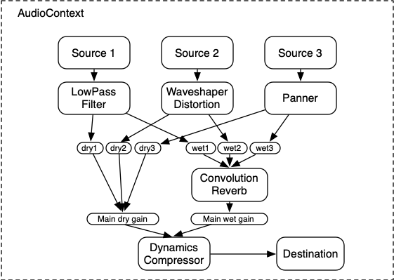

## 들어가기

최근 [itch.io](https://itch.io/)에서 열린 여러 잼 중 하나인 [1-BIT JAM](https://itch.io/jam/1-bit-jam-wow)에 참여했다. 여러 잼 중에서도 이 잼을 선택했던 것은 스스로 단 두가지 컬러만을 사용해야 한다는 제약 속에 그래픽적으로 오히려 다양한 시도를 할 수 있을 것이라는 생각이 들었기 때문이다. 또, 그 동안 공부했던 것을 이용해 직접 만든 셰이더로 3D 게임을 구현해볼 수 있는 좋은 기회라고 보았다.

어찌됐건 결국, 단 두가지 색상을 사용하면서도 그럴듯한 3D 그래픽을 그려내야 하는데, 사실 단박에 떠오른 예시가 하나 있었다.


"오브라 딘 호의 귀환"(Return of the Obra Dinn)이 좋은 레퍼런스가 됐고, "이것과 비슷하게"를 목표로 삼아 개발을 시작했다. (사진 출처 - [나무위키](https://namu.wiki/w/Return%20of%20the%20Obra%20Dinn))

## 기본적인 ShaderMaterial 만들기

가장 먼저, 직접 작성한 셰이더를 머테리얼로 사용할 것이므로, 이를 직접 만들어주는 것이 필요하겠다. 또한, BabylonJS의 셰이더 머테리얼 내 빌트인 어트리뷰트와 유니폼들을 사용하도록 한다. `reverseLightDirection`의 경우, "빛이 비추는 쪽의 역방향"을 나타내며, 여기서는 우선 `[1, 1, 1]`로 두었다. (오히려, "빛이 들어오는 방향"으로 표현하는 것이 더 직관적이었을까 싶기도 하다.)

```ts
const oneBitShaderMaterial = new ShaderMaterial("oneBitShader", scene, './1bit-shader', {
  attributes: ["position", "normal", "uv"],
  uniforms: ["worldViewProjection", "reverseLightDirection"],
});

oneBitShaderMaterial.setVector3("reverseLightDirection", new Vector3(1, 1, 1));
```

메쉬의 경우, 블렌더에서의 기본 메쉬들을 씬으로 엮어 `.glb`로 내보내서 사용했다.

```ts
SceneLoader.ImportMesh(
  '',
  rootUrl.join('/') + '/',
  sceneFile,
  scene,
  function (meshes) {
    meshes.forEach((mesh) => {
      mesh.material = oneBitShaderMaterial;
    });
  },
);
```

자, 이제 기본적인 버텍스 셰이더와 프래그먼트 셰이더를 작성할 시간이다.

버텍스 셰이더에서는 크게 해줄 것이 없다. 그저 BabylonJS에서 넘겨주는 위치와 법선들을 그대로 사용해주면 된다.

```glsl
// 1bit-shader.vertex.fx
#version 300 es
precision highp float;

// Attributes
in vec3 position;
in vec3 normal;
in vec2 uv;

// Uniforms
uniform mat4 worldViewProjection;

// Varying
out vec4 vPosition;
out vec3 vNormal;

void main() {
  vec4 p = vec4( position, 1. );
  vPosition = p;
  vNormal = normal;
  gl_Position = worldViewProjection * p;
}
```

프래그먼트 셰이더에서는 이전에 넘겨줬던 `reverseLightDirection`과 각 정점의 법선의 내적을 통해 어느 각 면에 도달하는 빛의 양을 구하고, 이를 단색의 그레이스케일로 표현해준다.

```glsl
// 1bit-shader.fragment.fx
#version 300 es
precision highp float;

uniform vec3 reverseLightDirection;

in vec4 vPosition;
in vec3 vNormal;

out vec4 fragColor;

void main(void) {
  vec3 normal = normalize(vNormal);
  float light = dot(normal, reverseLightDirection);
  fragColor = vec4(vec3(1. * light), 1.0);
}
```

그러면 아래같은 결과가 나온다. 지금도 그레이스케일로 표현되어 그럴싸하지만, 명백하게는 두가지 색상을 사용한 것이 아니다.


## 두가지 색상만 쓰기

그러면, 이제 진짜로 두가지 색상'만' 써보자. 우선은 배경색부터 까맣게 바꿔준다.

```ts
scene.clearColor = new Color4(0, 0, 0, 1);
```

그리고 나서, 메인 컬러와 서브 컬러를 유니폼으로 추가하여 넘겨준다. 하는 김에 빛 위치도 미세하게 조정해주었다.

```ts
const oneBitShaderMaterial = new ShaderMaterial("oneBitShader", scene, './1bit-shader', {
  attributes: ["position", "normal", "uv"],
  uniforms: ["worldViewProjection", "reverseLightDirection", "mainColor", "subColor"],
});

oneBitShaderMaterial.setVector3("reverseLightDirection", new Vector3(.75, .5, 1));
oneBitShaderMaterial.setVector3("mainColor", new Vector3(1, 1, 1));
oneBitShaderMaterial.setVector3("subColor", new Vector3(0, 0, 0));
```

그리고 프래그먼트 셰이더에서 들어오는 빛의 양에 따라 저마다 다른 굵기의 사선으로 어두움의 정도를 표현한다.

```glsl
void fill(vec2 p, float light) {
  if (light >= .4) {
    fragColor = vec4(mainColor, 1.);
  } else if (light >= .3) {
    if (mod(p.x - p.y, 2.0)==0.0) {
      fragColor = vec4(mainColor, 1.);
    } else {
      fragColor = vec4(subColor, 1.);
    }
  } else if (light >= .2) {
    if (mod(p.x - p.y, 4.0)==0.0) {
      fragColor = vec4(mainColor, 1.);
    } else {
      fragColor = vec4(subColor, 1.);
    }
  } else if (light >= .1) {
    if (mod(p.x - p.y, 8.0)==0.0) {
      fragColor = vec4(mainColor, 1.);
    } else {
      fragColor = vec4(subColor, 1.);
    }
  } else {
    fragColor = vec4(subColor, 1.);
  }
}

void main(void) {
  vec2 p= vec2(floor(gl_FragCoord.x), floor(gl_FragCoord.y));
  vec3 normal = vNormal;
  float light = dot(normal, reverseLightDirection);
  fill(p, light);
}
```

이제 실제로 단 두가지 색상만을 사용하는, 사선 스케치로 그린듯한 느낌의 셰이더 머테리얼을 완성했다.
얼핏 회색을 사용한 것 같은 부분도, 아래 스크린샷을 통해 확인할 수 있듯 사실은 흰색과 검은색 픽셀의 반복으로 표현한 부분이다.

여기에, 메쉬에 서브디비전(subdivision)을 사용해서, 메쉬들이 더 부드럽게 나타나도록 수정했다.



## 그림자 넣기

그림자가 없으니 각 메쉬가 지면에 있는 것인지 아닌지 알기도 어렵고, 많이 어색해보인다.
일단은 바닥 메쉬에 적당한 머테리얼을 써두고, 그림자를 넣어보도록 한다.

완전히 검은 그림자를 나타내기 위해, `shadowGenerator`의 `setDarkness`를 `0`으로 설정해준다.

```ts
const ground = MeshBuilder.CreateGround('ground', { width: 100, height: 100 }, scene);
ground.position.y = -1.438;

const groundMaterial = new SimpleMaterial('mat', scene);
groundMaterial.diffuseColor = new Color3(1, 1, 1);
ground.material = groundMaterial;
ground.receiveShadows = true;

const shadowGenerator = new ShadowGenerator(4096, light)
shadowGenerator.setDarkness(0);
```

이후 그림자 생성기에 씬 로더에서 가져오는 메시들을 셰도우 캐스터로 추가해준다.

```ts
meshes.forEach((mesh) => {
  mesh.material = oneBitShaderMaterial;
  shadowGenerator.addShadowCaster(mesh);
});
```


## 외곽선 넣기

그러고 나서도 뭔가 아쉽다. 뭐가 아쉬운가 생각해보니, 외곽선이 없어 각 메쉬에 대한 구분이 애매하고, 무엇보다도 썩 이뻐보이지 않는다는 문제가 있다.

BabylonJS에서는 렌더가 완료된 뷰에 대해 셰이더를 통한 후처리 효과를 넣을 수 있도록 `PostProcess`가 존재하므로, 이것을 써서 외곽선을 넣어볼 것이다.

외곽선의 구현에는 여러가지 방법이 있겠지만, 여기서는 뎁스 맵(Depth Map)을 사용하는 쪽으로 구현해보았다.

```ts
const depthRenderer = scene.enableDepthRenderer();
const postProcess = createPostProcess(camera);

postProcess.onApply = function (effect) {
  const subColorRgb = hexToRgb(subColor.value, true);
  effect.setVector2('screenSize', new Vector2(canvas.width, canvas.height));
  effect.setFloat('depthThreshold', 0.2);
  effect.setTexture('depthSampler', depthRenderer.getDepthMap());
  effect.setVector3('outlineColor', new Vector3(...subColorRgb));
};
```

```glsl
// outline.fragment.fx
#ifdef GL_ES
precision highp float;
#endif

varying vec2 vUV;

uniform sampler2D depthSampler;

void main(void)
{
  gl_FragColor=vec4(vec3(texture2D(depthSampler,vUV).r), 1.);
}
```

구현한 뎁스맵은 아래와 같은 형태가 된다. 도중에, 곡선이 많지 않은 정육면체 메쉬 특성 상 셰이더 효과가 크게 드러나지 않아서, 기존 정육면체 메쉬를 [수잔](https://www.dummies.com/article/technology/software/animation-software/blender/meet-suzanne-the-blender-monkey-142918/)으로 바꿔줬다.

보시다 시피, 카메라를 기준으로 멀어질수록 뎁스 맵의 값이 커지는 것(화면 상으로는, 밝아지는 것)을 확인할 수 있다.


자, 이 다음엔 이 뎁스 맵을 기준으로 각 오브젝트의 윤곽을 감지하기 위해 Edge detection을 수행한다. 일정한 임계값(threshold)를 정해두고, 특정 값이 넘어가게 되면 해당 부분에 외곽선을 그리도록 한다.

```glsl
// ...
uniform vec3 outlineColor;

const float scale=1.;
const float halfScaleFloor=floor(scale*.5);
const float halfScaleCeil=ceil(scale*.5);
const float depthThreshold=1.5;

vec2 texelSize=vec2(1./screenSize.x,1./screenSize.y);
vec2 bottomLeftUV=vUV-texelSize*halfScaleFloor;
vec2 topRightUV=vUV+texelSize*halfScaleCeil;
vec2 bottomRightUV=vUV+vec2(texelSize.x*halfScaleCeil,-texelSize.y*halfScaleFloor);
vec2 topLeftUV=vUV+vec2(-texelSize.x*halfScaleFloor,texelSize.y*halfScaleCeil);

float depth0=texture2D(depthSampler,bottomLeftUV).r;
float depth1=texture2D(depthSampler,topRightUV).r;
float depth2=texture2D(depthSampler,bottomRightUV).r;
float depth3=texture2D(depthSampler,topLeftUV).r;
float diffDepth0=depth1-depth0;
float diffDepth1=depth3-depth2;
float edgeDepth=sqrt(pow(diffDepth0,2.)+pow(diffDepth1,2.))*100.;

gl_FragColor=vec4(vec3(edgeDepth), 1.);
```

여기서, `scale`과 이를 통해 계산한 `halfScaleFloor`와 `halfScaleCeil`이라는 값을 사용했다. `scale`이 커질수록, 그릴 외곽선은 더 굵어져야 한다. 이에 따라 `halfScaleFloor`와 `halfScaleCeil`은 `scale`이 증가할 때 각각 번갈아가면서 증가하는데, 덕분에 특정 픽셀을 중심으로 정확히 한 픽셀씩만 확장시켜 나가는 것을 보장해준다. ([사진 출처](https://roystan.net/articles/outline-shader/))


그 결과, 아래와 같은 Edge Detection 결과를 얻었다.


이제 저렇게 검출한 외곽선들이 임계값을 넘어가게 되면 그 부분에는 검은색으로 외곽선을 그려주고, 그렇지 않은 경우에는 그냥 기존 텍스처를 그대로 보여주면 된다.

```glsl
// ...
vec4 baseColor=texture2D(textureSampler,vUV);

// ...

if(edgeDepth>depthThreshold){
  gl_FragColor=vec4(outlineColor,1.);
}else{
  gl_FragColor=baseColor;
}
```

그러면 아래와 같이 내가 생각했던 형태로 외곽선이 그려진 것을 확인할 수 있다. 개인적으로 명과 암이 아주 극명한 이 느낌이 참 마음에 든다. 물론 단순 외곽선 추가 외에도 빛 위치 조정, 바닥 머테리얼 변경 등 부차적인 작업이 있긴 했다.

한가지 아쉬운 점은 아래 바닥면과 맞닿아 있는 경우(세번째의 원뿔 메쉬처럼), 뎁스의 차이가 크지 않아 명확하게 윤곽선 검출을 하기가 어렵고, 그렇기 때문에 외곽선이 제대로 그려지지 않았다는 점이다.


## 마치며

완성된 내용은 [여기](https://shubidumdu.github.io/sketchbook/pages/1bit-shader/)에서 확인해볼 수 있다. 이용자가 임의로 메인/서브 컬러를 지정하여 꽤 독특한 느낌도 내볼 수 있다.

결론적으로 여기에서 만들어놓은 셰이더를 바탕으로 1-BIT JAM에 [LIGHTS OUT, SHOT DOWN](https://itch.io/jam/1-bit-jam-wow/rate/2224187)을 만들어 제출했고, 개인적으로 꽤 만족스러운 과정과 결과를 얻었다는 생각이 든다.

<iframe frameborder="0" src="https://itch.io/embed/2224187?link_color=000000" width="552" height="167"><a href="https://shubidumdu.itch.io/lights-out-shot-down">LIGHTS OUT, SHOT DOWN by Shubidumdu</a></iframe><br>
