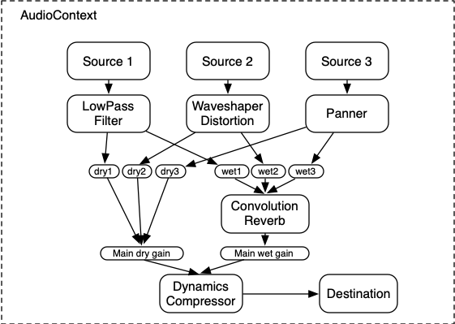

## 들어가기


피젯 스피너는 베어링을 축으로 회전하도록 만든 심심풀이용 장난감이다. 실제로 사용해보면 한번 튕겼을 때 꽤 오랜 시간 동안 빙빙 돌아가기 때문에, 이것을 보고 있으면 꽤 중독성이 있다.

사실 구글에서도 [이를 인터렉티브하게 구현해둔 것](https://www.google.com/search?q=%08fidget+spinner)이 있다. **SPIN** 버튼을 누르면 피젯 스피너가 회전하는 형태다.


이걸 3D로 실물처럼 그럴싸하게 구현하면 꽤 재밌지 않을까 하는 생각에, 이번 포스트에서는 BabylonJS로 이 인터랙티브 피젯스피너를 구현한 과정에 대해 담아보려고 한다.

## 모델 가져오기

우선 피젯스피너 모델을 하나 가져온다. 직접 만들면 좋기야 하겠지만, 언제 모델링을 직접 하고 있겠는가.

Sketchfab에 이미 근사한 모델들이 꽤 많아서, 그 중 [적당해 보이는 모델](https://sketchfab.com/3d-models/spinner-d850bdc2301348259209cca806c470a7)을 가져왔다.



자, 이걸 그대로 BabylonJS에서 가져오면 된다.

```ts
const result = await SceneLoader.ImportMeshAsync(
    'Spinner',
    rootUrl.join('/') + '/',
    sceneFile,
    scene,
  );

const [root] = result.meshes;
const [spinner] = root.getChildren();
spinner.parent = null;
spinner.rotationQuaternion = null;
root.dispose();
```

항상 `.glb` 파일을 로더로 가져오면 `__root__` 라는 이름의 부모 노드로 자동으로 감싸져있다. 편의를 위해 이를 제거해주고, `rotationQuaternion`을 `null`로 설정해준다.

기본적으로 `.glb`를 통해 가져온 모델은 회전 쿼터니언(`rotationQuaternion`)이 설정되어 있는데, 이 경우 `rotation` 프로퍼티를 사용할 수 없기 때문이다. 그렇기 때문에 직접 설정을 해제해주는 작업이 필요하다.

사실 회전에 있어 이 `rotationQuaternion`을 그냥 써도 된다. 쿼터니언을 쓰는 이유는 보통 [짐벌락 이슈](https://en.wikipedia.org/wiki/Gimbal_lock)를 피하기 위해서다. 근데 이번에 구현하고자 할 피젯스피너는 회전이 오직 하나의 축에 대해서만 이루어질 것이기 때문에, 회전을 더 쉽게 다루기 위해 그냥 `rotation`을 사용하고자 했다.

## 피젯스피너 잡기

먼저, 피젯스피너를 "잡는 것"부터 해보자. 이걸 구현하려면 레이캐스트(Raycast)를 통해 포인터가 메쉬의 어느 지점에서 맞닿게 되는지에 대한 파악이 필요하다.

BabylonJS에서는 레이캐스트를 `Scene.pick` 메서드로 아주 쉽게 처리할 수 있다. 이는 씬 뷰포트의 특정 위치에서 발사하는 레이를 통해 어떤 메쉬와 부딪히는지, 또 정확히 어떤 위치에 부딪히는지에 대해 파악할 수 있게 해준다.

```ts
const pickInfo = scene.pick(scene.pointerX, scene.pointerY);
```

이제 여기서의 결과를 통해 피젯스피너를 잡았을 때의 동작에 대해 처리해준다.

```ts
const handlePointerMove = () => { 
  // ... 
};

const handlePointerUp = () => { 
  // ... 
};

if (pickInfo.pickedMesh?.name) {
  // 현재 레이와 부딪힌 메쉬가 배경이 아니라면 => 피젯스피너를 잡은 것
  if (!pickInfo.pickedMesh.name.includes('Background')) {
    camera.detachControl(); // 카메라 컨트롤 비활성화
    state.startPickInfo = pickInfo; // 메쉬를 잡은 위치 정보에 대해 저장
    state.velocity = 0; // 현재 속도를 0으로 초기화 -> 스피너가 도는 것을 멈추게 됨
    state.startAngle = spinner.rotation.y; // 잡기 시작한 시점의 스피너 회전 각도를 저장
    state.startPickTime = performance.now(); // 잡기 시작한 시점의 시간을 저장
    canvas.addEventListener('pointermove', handlePointerMove);
    canvas.addEventListener('pointerup', handlePointerUp);
  }
}
```

이제 스피너를 잡은 이후, 포인터를 움직일 때 이에 따라 스피너가 조금씩 회전하도록 해보자.

이 부분에서 약간의 수학이 필요하다. 먼저 `vec3(1,0,1)`을 피젯스피너를 잡기 시작한 위치(`P_start`)와 피젯스피너를 잡고 움직이고 있는 현재 위치(`P`)의 포지션 벡터값에 각각 곱해서 y축의 위치값을 무시한다. 수평한 평면을 기준으로, 어느 정도의 각도로 마우스를 이동시켰는지가 관심사이기 때문에 y축을 고려하고 싶지 않아서다.

$$
P = (1, 0, 1)\times(x, y, z) = (x, 0, z)
$$
$$
P_{start} = (1, 0, 1)\times(x_{start}, y_{start}, z_{start}) = (x_{start}, 0, z_{start})
$$

그리고 이걸 정규화한다. 이렇게 하면 벡터의 길이가 1이 되고, 두 포지션 벡터에 대한 내적을 구한 뒤 아크코사인(`acos`)함수를 통해 두 벡터가 이루는 라디안 각도를 구할 수 있다.

$$
Angle(P, P_{start}) = \cos^{-1}(\frac{P \cdot P_{start}}{|P||P_{start}|})
$$

그리고, 마우스의 위치에 따라 회전하는 방향 역시 구해야 하는데, 여기서는 외적(`cross`)를 활용한다. 두 벡터 간의 외적을 구한다는 것은, 두 벡터가 이루는 평면에 대해 수직인 벡터를 구하는 것과 동일하다. 앞서 y축에 대한 벡터를 무시했기 때문에, 두 포지션 벡터값이 이루는 바닥과 완전히 평행하고, 그렇기 때문에 외적의 y축이 0보다 큰지 작은지에 대한 비교를 통해 마우스의 회전 방향에 대해 파악할 수 있다. (벡터를 곱하는 것과 동일한 수학 기호를 사용했지만, 아래의 경우는 외적을 의미하는 것임에 주의)

$$
Cross(P, P_{start}) = (P \times P_{start}) = (x, 0, z) \times (x_{start}, 0, z_{start}) = (0, xz_{start} - x_{start}z, 0)
$$

그래서, 이 내용을 직접 작성해보면 아래와 같다.

```ts
const handlePointerMove = () => {
  const pickInfo = scene.pick(scene.pointerX, scene.pointerY);
  const point = pickInfo.pickedPoint;
  if (point && state.startPickInfo) {
    const _point = point // 현재의 포인터 위치
      .multiplyToRef(new Vector3(1, 0, 1), new Vector3())
      .normalize();
    const _startPoint = state.startPickInfo // 잡기 시작한 시점의 포인터 위치
      .pickedPoint!.multiplyToRef(new Vector3(1, 0, 1), new Vector3())
      .normalize();
    const dot = Vector3.Dot(_point, _startPoint);
    const rad = Math.acos(dot);
    const cross = Vector3.Cross(_point, _startPoint);
    const angle = cross.y > 0 ? -rad : rad;
    spinner.rotation.y = state.startAngle + angle; // 이전 각도에 현재의 각도를 더해줌
  }
};
```


## 피젯스피너 튕기기

이제 실질적으로 재미를 느낄 수 있는, "튕기기" 작업을 해보자. 여기서 말하는 "튕긴다"는 것은 피젯스피너를 잡고 움직이다가 놓은 시점에 피젯스피너를 돌리는 속도를 구해 그 만큼의 힘으로 피젯스피너를 회전시킨다는 것을 의미한다.

속도(`velocity`)를 구하려면 잡기 시작한 시점과 놓은 시점의 시간 차이와 이동한 거리를 구한다. 그리고는 구한 거리를 시간으로 나누면 된다. 그리고 나서 이전의 구현 내용과 유사하게 외적을 통해 회전 방향을 구하고, 상태를 업데이트시켜준다.

```ts
const handlePointerUp = () => {
  const point = scene.pick(scene.pointerX, scene.pointerY).pickedPoint;
  if (point && state.startPickInfo) {
    const _point = point.multiplyToRef(new Vector3(1, 0, 1), new Vector3());
    const _startPoint = state.startPickInfo.pickedPoint!.multiplyToRef(
      new Vector3(1, 0, 1),
      new Vector3(),
    );
    const distance = Vector3.Distance(_point, _startPoint); // 두 지점 간의 거리
    const cross = Vector3.Cross(_point, _startPoint);
    const direction = cross.y > 0 ? -1 : 1;
    const time = performance.now() - state.startPickTime;
    // 속도 = 거리 / 시간
    // `50`은 속도 조절을 위한 임의의 상수
    state.velocity = direction * (distance / time) * 50;
  }
  state.startPickInfo = null;
  state.endPickTime = performance.now(); // 잡기를 놓은 시점의 시간을 저장 -> 감속에 쓰임
  camera.attachControl(canvas, true); // 다시 카메라 컨트롤을 활성화
  // 첨부한 이벤트 핸들러에 대한 clean-up
  canvas.removeEventListener('pointermove', handlePointerMove);
  canvas.removeEventListener('pointerup', handlePointerUp);
};
```

## 피젯스피너 감속

아마 위의 내용까지 구현했다면 피젯스피너는 회전할 것이다. 문제는 동일한 속도로 무한히 회전한다는 것이다. 이를 해결하기 위해, 피젯스피너가 회전하는 속도를 실제처럼 감속시켜주는 작업이 필요하다.

이 부분에서 [지수적 감쇠](https://en.wikipedia.org/wiki/Exponential_decay)(Exponential Decay)를 활용한다. 지수적 감쇠는 운동학에서 속도와 가속도를 제어하기 위해 종종 사용한다. 우리가 구현하고자 하는 것처럼 실생활에서 피젯스피너가 돌아가는 것처럼 운동을 시작할 때는 빠르게 가속하지만 그 시간이 지나면서 점차 속도가 줄어들어야 하기 때문이다.

아래는 시간의 경과에 따른 속도를 얻기 위한 일반적인 형태의 지수 감속 함수다. `v_0`는 초기 속도, `lambda`는 감쇠 상수(`decayConstant`), `t`는 시간을 의미한다.

$$
v(t) = v_0 \cdot e^{-\lambda t}
$$

이걸 그대로 TS에서 구현하면 아래와 같다.

```ts
const calcAngularVelocity = (
  initialVelocity: number,
  startTime: number,
) => {
  const decayConstant = 0.1;
  const time = (performance.now() - startTime) * 0.001;
  return initialVelocity * Math.exp(-decayConstant * time);
};
```

이렇게 구현해두면 나머지는 간단하다. 구현한 지수 감소 함수를 적용해 스피너에 회전을 매 프레임마다 적용해주면 된다.

```ts
engine.runRenderLoop(() => {
  const velocity = calcAngularVelocity(state.velocity, state.endPickTime);
  spinner.rotation.y += velocity;
  // ...
});
```

이제 꽤나 자연스럽게 회전한다.


## 구현 결과

<iframe
  id="Spinner"
  title="Spinner"
  loading="lazy"
  width="800"
  height="600"
  style="margin:0 auto; max-width: 100%;"
  src="https://shubidumdu.github.io/sketchbook/pages/spinner"
>
</iframe><br>

<a href="https://shubidumdu.github.io/sketchbook/pages/spinner" target="_blank" style="display:block;text-align:center;">새 창에서 열기</a>

## 마치며

사실 포스트에서 언급하지 않은 몇가지 디테일이 있긴 하다. 이를테면 원본 모델에 굴곡이 많아 레이캐스팅을 했을 때 마우스를 이동하면 부딪히는 위치가 급격하게 변하면서 모델이 덜덜거리는 문제가 있어 따로 이를 덮어주는 투명한 실린더 메쉬를 사용해 그러한 굴곡을 없애고자 했다.

그리고는 모션 블러를 적용했다. 사실 이 부분을 직접 구현해보려 했는데 생각보다 쉽지 않은 문제라 빌트인 API를 사용해야만 했다. 모션 블러에 관해서는 특히 더 알아보고 싶은 생각이 많아 별도의 포스트로 다뤄볼 수 있도록 하겠다.

또, 스피너가 회전할 때 회전 속도에 맞춰 적절하게 소리를 내도록 했으면 싶었는데, 디테일을 크게 신경쓰지 않으면 생각보다 많이 어색해보여서.. 우선은 미뤄두었다. 추후 따로 작업을 해봐야겠다. :)
