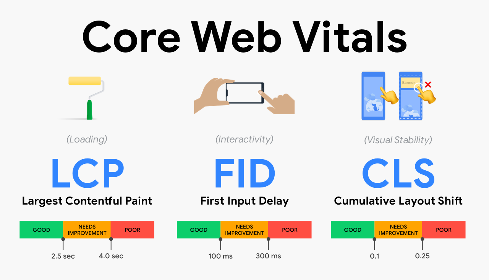
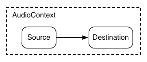

## 들어가기

혹시 글을 보시는 여러분께서는 webRTC에 대해서 들어본 적이 있을까요? 저는 꽤 예전부터 드문드문 들어보았지만, 실제로 이것이 무엇인지, 어떤 방식으로 동작하는지에 대해서는 전혀 알지 못했고, 그럴 기회가 사실 좀처럼 없었습니다.

그러다가 우연히 webRTC가 "대략적으로는 이렇다" 라는 내용을 듣고, 꽤 많은 흥미와 가능성을 느껴서 살펴보았고, 이에 대해 간단한 실습을 통해 정리해보고 싶었습니다.

## WebRTC란?

사진 출처 - https://www.agora.io/en/blog/how-does-webrtc-work/



WebRTC는 웹 애플리케이션이 별도의 중개(intermediary) 없이도 브라우저 간의 P2P 연결을 구축하여 실시간으로 오디오/비디오 미디어를 캡처하고 스트리밍하거나, 데이터를 교환할 수 있도록 하는 기술입니다.

실시간으로 데이터를 주고받는다는 점에서 WebSocket이 떠오르기도 하는데, WebRTC는 서버를 통해 데이터를 주고받는 것이 아니라, 브라우저 간의 직접적인 연결을 통해 데이터를 주고받는다는 점이 주요합니다.

두 클라이언트가 데이터를 주고받는 데에 서버가 필요없다니! 신기하지 않나요? 브라우저와 브라우저 간에 직접적인 연결을 구축해서 데이터를 주고받을 수 있다는 사실이!

하지만, 간단한 실습을 거쳐보면서, 이런 마법 같은 일이 일어나기 위해서는 그 뒤의 수많은 노력들이 필요하다는 점을 알았습니다.

## 실습해보기

사실, WebRTC을 다루기 위해서는 개념적인 부분에 대해 많이 이해해야 했습니다. 저 역시 이러한 부분들을 전부 이해하지는 못했고, 이를 글에 전부 담을 수 없다는 것을 알고 있습니다.

그래서, 실습을 통해 접하게 되는 개념들에 대해서만 간략하게 짚어보고자 합니다.

대부분의 WebRTC에서는 비디오/오디오를 캡처하여 화상통화를 구현하는 형태의 실습들이 많은 것으로 보이는데, 저는 두 피어 간에 임의의 데이터를 주고받을 수 있도록 하는 간단한 **데이터 채널**(Data Channel)을 구축해보고자 합니다.

## Signaling Server (시그널링 서버) 구축

분명 `앞에서 서버가 필요없다고 해놓고 무슨 서버 타령이냐?`는 생각을 할 수도 있습니다. 안타깝게도 WebRTC는 여전히 중간에 서버가 없으면 연결을 구축할 수 없습니다. 사실 어떻게 보면 당연한 것이, P2P 연결을 구축하려면 다른 피어가 어디에 있고, 어떤 방식으로 연결을 구축해야 하는지에 대해 알아야 하는데, 이는 서버의 도움 없이는 불가능하기 때문입니다. 다시 정리하자면, 연결을 구축한 후 "데이터를 주고 받는 데"에는 서버가 필요없지만, 여전히 그 "연결을 구축하는 데"에는 서버의 도움이 필요합니다.

이상하게도 제가 실습을 해보려고 이래저래 찾아봤는데, 이 시그널링 서버의 구축 방법에 대한 명쾌한 가이드가 존재하지 않았습니다. 다른 누군가의 특정한 실습 사례 및 구현 예시가 있을 뿐이었죠. 후에 그 이유를 알게 된 것이, 재밌게도 이 시그널링 서버의 구축에 대한 것은 **WebRTC 사양에 정의되어 있지 않습니다**.

WebRTC 연결을 구축하기 위해 가장 먼저 다루어지는 내용이 정작 사양에는 명시되어 있지 않다는 점은 언뜻 의아하게 보일 수도 있습니다. 근데, 의외로 그 이유는 간단합니다. WebRTC는 모든 사용 사례를 예측할 수 없습니다. 따라서 개발자가 구현하고자 하는 내용에 따라 적절한 네트워킹 기술과 메시징 프로토콜을 선택하도록 하는 것이 더 합리적이기 때문입니다. 특히나, 개발자가 이미 두 디바이스를 연결지을 방안을 구축해둔 상황이라면, WebRTC의 관점에서 굳이 별도로 정의된 사양을 따르게 하는 것은 제법 비효율적일 수 있습니다.

다시 말해 **어떤 식으로든 두 클라이언트 간에 시그널링 정보가 교환될 수만 있다면, 그 구현의 형태는 어떻게 되든 상관 없습니다**. WebSocket을 사용할 수도 있고, HTTP를 이용할 수도 있습니다. 그렇기 때문에 기존의 프로젝트에 WebRTC를 도입하고자 한다면, 기존에 구축되어 있는 시스템에 적합한 방식을 선택하면 됩니다.

제 경우에는 socket.io를 통해 WebSocket을 활용하는 방법으로 시그널링 서버를 구축해보았습니다.

여기서 구현하고자 하는 것은 아래와 같은 그림이 됩니다. (출처 - https://hpbn.co/webrtc/)



사실 서버에서 다루어져야 하는 일은 생각보다 간단합니다. 한 쪽의 피어가 생성하여 전달하는 Offer, Answer, Candidate 정보들을 다른 피어에게 전달해주는 것이 전부입니다. 아래 코드에서 많은 부분들을 생략하긴 했지만, 결국 시그널링 서버 측에서 해주는 실질적인 역할은 아래의 내용이 전부입니다.

각각의 이벤트에서 다루어주는 내용에 대해서는 아래 쪽의 클라이언트 코드를 설명하는 쪽에서 이야기 하도록 하겠습니다.

```ts
io.on("connection", (socket) => {
  // ...

  socket.on("offer", (offer: RTCSessionDescriptionInit) => {
    // ...
    socket.emit("offer", offer);
  });

  socket.on("answer", (answer: RTCSessionDescriptionInit) => {
    // ...
    socket.emit("answer", answer);
  });

  socket.on("candidate", (candidate: RTCIceCandidate) => {
    // ...
    socket.emit("candidate", candidate);
  });
});
```

## Peer Connection (피어 연결) 생성

자, 이제 브라우저 측에서의 피어 연결을 구축해야 하는데, 이 부분은 개념적으로 좀 더 어렵습니다. 먼저 코드를 살펴보겠습니다.

```ts
const config: RTCConfiguration = {
  iceServers: [
    {
      urls: [
        "stun:stun.l.google.com:19302",
        "stun:stun1.l.google.com:19302",
        "stun:stun2.l.google.com:19302",
        "stun:stun3.l.google.com:19302",
        "stun:stun4.l.google.com:19302",
      ],
    },
  ],
};

const pc = new RTCPeerConnection(config);
```

여기서 `iceServers` 라는 조금 생소한 개념이 등장했습니다. 여기서의 **ICE**에 대해 한번 짚고 넘어갈 필요가 있겠네요.

### ICE (Interactive Connectivity Establishment)

ICE는 웹 브라우저가 피어와 연결할 수 있도록 해주는 프레임워크입니다. 하나의 피어 A에서 피어 B로의 연결은 다양한 문제로 실패할 수 있습니다. 연결을 차단하는 방화벽을 우회해야 하고, 대부분의 경우처럼 기기에 Public IP 주소가 없는 경우에 고유한 주소를 제공해야 하며, 라우터가 피어와의 직접 연결을 허용하지 않는 경우에는 서버를 통해 데이터를 중계(relay)해야 합니다.

ICE는 **STUN** 또는 **TURN** 서버를 통해 이를 수행합니다. (이미지 출처 - https://developer.mozilla.org/en-US/docs/Web/API/WebRTC_API/Protocols)

### STUN (Session Traversal Utilities for NAT)


먼저 **STUN**은 Public 주소를 검색하고 라우터에서 피어와의 직접적인 연결을 방해하는 제한 사항이 있는지에 대해 확인하는 프로토콜입니다.

클라이언트가 인터넷 상의 STUN 서버에 요청을 보내면, 서버는 클라이언트의 공개 주소와 라우터의 NAT 뒤에서 클라이언트에 액세스할 수 있는지 여부에 대해 회신합니다. (이미지 출처 - https://wiki.teltonika-networks.com/index.php?title=Network_Address_Translation&mobileaction=toggle_view_desktop)


NAT(Network Address Translation)란, 로컬 네트워크 내 여러 Private IP 주소를 인터넷에 정보를 전송하기 전에 Public IP 주소로 매핑하는 방법을 의미합니다. 일반적으로 "공유기"라고 불리는 가정용 라우터를 포함해서, 여러 디바이스가 하나의 단일 Public IP를 사용하고자 할때 NAT가 사용됩니다.

일부 라우터는 네트워크를 통해 디바이스로 들어오는 연결 자체를 허용하지 않는 경우가 있습니다. 이 경우는 STUN 서버로 찾은 Public IP가 있어도, 직접적인 연결을 구축할 수 없다는 의미인데, 이런 상황에서는  **TURN** 서버를 사용해야 합니다.

### TURN (Traversal Using Relays around NAT)


NAT를 사용하는 일부 라우터에는 **Symmetric NAT**라고 불리는 제한을 적용합니다. 이는 라우터가 이전에 연결한 적이 있는 피어의 연결에 대해서만 연결을 허용한다는 의미입니다.

**TURN**은 TURN 서버와의 연결을 구축하고, 해당 서버를 통해 모든 정보를 중계(relay)하여 Symmetric NAT를 우회합니다. TURN 서버와의 연결을 생성하고, 모든 피어에게 해당 서버로 패킷을 보내도록 지시하면, 해당 서버가 패킷을 받아 다른 피어에게 전달합니다. 이는 말 그대로, 서버를 통해 모든 데이터를 중계하는 것이기 때문에, 그만큼 오버헤드가 발생하는 방안입니다. 따라서 가능하다면 STUN 서버를 사용하는 것이 좋고, TURN은 마땅한 대안이 없는 경우에만 사용됩니다.

다시 코드로 돌아와서, `iceServers`에는 앞서 말씀드린 것처럼 이 STUN과 TURN 서버의 목록이 들어가게 됩니다. 이를 통해 브라우저는 피어와의 연결을 구축하기 위한 정보를 수집합니다. 그리고 나서 해당 설정으로 `RTCPeerConnection` 인스턴스를 생성합니다.

```ts
const config: RTCConfiguration = {
  iceServers: [
    { // STUN
      urls: [
        "stun:stun.l.google.com:19302",
        "stun:stun1.l.google.com:19302",
        "stun:stun2.l.google.com:19302",
        "stun:stun3.l.google.com:19302",
        "stun:stun4.l.google.com:19302",
      ],
    },
    { // TURN
      urls: 'turn:my-turn-server.mycompany.com:19403',
      username: 'optional-username',
      credential: 'auth-token'
    }
  ],
};

const pc = new RTCPeerConnection(config);
```

## Data Channel (데이터 채널)

일반적인 WebRTC 예제들에서는 리모트 스트림(Remote stream)을 통해 오디오/비디오 스트림을 캡처하여 구축한 피어 커넥션을 통해 다른 피어에게 전달합니다.

다만 제가 구현하고자 하는 것은 좀더 일반적인 임의의 데이터를 주고받는 것이므로, 여기에서는 **데이터 채널**(Data channel)이라는 API를 사용합니다. 한쪽의 피어에서 데이터 채널을 생성하고, 해당 데이터 채널에 이벤트 핸들러를 할당합니다.

```ts
// 데이터 채널을 생성합니다.
const dataChannel = pc.createDataChannel("My dataChannel");

dataChannel.addEventListener("open", (e) => {
  // ...
});

dataChannel.addEventListener("message", (e) => {
  // ...
});
```

피어 연결이 잘 되었고 데이터 채널이 잘 생성되었다면, 리모트 피어 측에서는 `datachannel`이라는 이름으로 피어 커넥션 쪽에서 이벤트가 발생하며, 이쪽으로 생성된 데이터 채널이 넘어오게 됩니다. 따라서 이쪽에도 이벤트 핸들링을 처리해주어야 합니다. 여기서 유의할 점은, `datachannel` 이벤트 자체가 리모트 피어에서 데이터 채널이 생성되어 넘어오는 경우에만 발생한다는 것입니다. 로컬 피어에서는 데이터 채널이 생성되었더라도 이 이벤트가 트리거되지 않습니다. - [참고](https://stackoverflow.com/questions/62614533/webrtc-rtcdatachannels-onmessage-event-is-not-firing)

```ts
// 리모트 피어 쪽에서 데이터 채널이 생성되면, 
// 피어 커넥션 인스턴스에서 `datachannel` 이벤트가 발생합니다.
pc.addEventListener("datachannel", (event) => {
  dataChannel.addEventListener("open", (e) => {
    // ...
  });

  dataChannel.addEventListener("message", (e) => {
    // ...
  });
});
```

## 시그널링 (Signaling)

자, 피어 커넥션과 데이터 채널을 만들었으니, 이제 연결된 것일까요? 아닙니다!

지금 저희는 현재 피어 커넥션과 데이터 채널을 각각 생성하긴 했지만, 여전히 각 피어는 서로에 대한 대한 정보를 전혀 모르는 상태입니다. 여전히 실질적인 연결은 이루어지지 않았습니다.

이제 앞서 저희가 구축했던 시그널링 서버를 사용하여 실제로 시그널링 작업을 수행해야 합니다. 저희가 시그널링 서버를 Websocket 기반으로 구축했기 때문에, 클라이언트도 마찬가지로 이를 활용해야 합니다.

```ts
socket.on("connect", () => {
  // ...
});

socket.on("disconnect", () => {
  // ...
});

socket.on("offer", async (offer: RTCSessionDescriptionInit) => {
  pc.setRemoteDescription(offer);
  const answer = await pc.createAnswer();
  pc.setLocalDescription(answer);
  socket.emit("answer", answer);
});

socket.on("answer", (answer: RTCSessionDescriptionInit) => {
  pc.setRemoteDescription(answer);
});

socket.on("candidate", (candidate: RTCIceCandidate) => {
  pc.addIceCandidate(candidate);
});
```

### SDP

여기서 위의 `answer`, `offer` 각각의 이벤트에서 전달되는 내용을 살펴보면 아래 예시와 유사한 형태입니다.

```ts
{
  type: "offer",
  sdp: `
    v=0
    o=- 123456 123458 IN IP4 10.0.1.2
    s=My sample flow
    i=4 channels: c1, c2, c3, c4
    t=0 0
    a=recvonly
    m=audio 5004 RTP/AVP 98
    c=IN IP4 239.69.11.44/32
    a=rtpmap:98 L24/48000/4
    a=ptime:1
    a=ts-refclk:ptp=IEEE1588-2008:00-11-22-FF-FE-33-44-55:0
    a=mediaclk:direct=0
  `
}
```


여기서 말하는 **SDP**(Session Description Protocol)는 데이터 전송 시에 두 피어가 서로에 대해 이해할 수 있도록 연결의 멀티 미디어 컨텐츠를 설명하는 표준입니다. 이는 미디어 컨텐츠 그 자체가 아니라, 컨텐츠를 설명하는 메타데이터에 해당합니다.


엄밀히 따지면 사실 SDP는 그 이름과는 다르게, 프로토콜이라기 보다는 디바이스 간에 미디어를 공유할 때에 그 연결을 설명하는 데에 사용되는 데이터의 형식입니다. SDP에 대해 심도있게 다루는 것은 이 포스트의 범위에서 벗어나므로, 관련해서 좀 더 알고 싶은 경우, 간략하게 정리되어 있는 이쪽의 [SDP 명세](https://dev.audinate.com/GA/ddm/userguide/1.1/webhelp/content/appendix/sample_sdp_specification.htm)를 살펴보셔도 좋겠습니다.

### ICE Candidate

다시 돌아와서, 위 쪽의 코드를 살펴보면, `candidate`라는 이벤트에 대해 다루고 있는 것이 보입니다. **ICE Candidate**란, 전송 중인 피어가 소통할 수 있는 방식에 대해 설명하는 내용을 담고 있습니다. 각 피어는 candidate가 발견될 때마다 그 순서대로 candidate를 전송하며, 심지어 미디어 스트리밍이 이미 시작된 경우에도 후보에 대한 전송은 계속해서 이루어집니다.

두 피어가 상호 호환 가능한 후보에 동의하면, 각 피어에서 해당 후보의 SDP를 사용해서 연결을 구성하며, 이로 인해 데이터 채널이 열린(opened) 상태가 되면, 비로소 데이터 채널을 통해 데이터를 전달할 수 있는 상태가 됩니다.

```ts
// socket으로부터 candidate 후보를 전달받으면 이를 피어 연결에 후보로 추가합니다.
socket.on("candidate", (candidate: RTCIceCandidate) => {
  pc.addIceCandidate(candidate);
});

// 구축한 피어 연결에서, 새 후보를 발견하면 이를 socket에 전달합니다.
pc.addEventListener("icecandidate", (event) => {
  if (event.candidate) {
    socket.emit("candidate", event.candidate);
  }
});
```

## 결과물 살피기

자, 여기까지 이루어졌다면, 각 클라이언트에서 소켓을 연결하고, 한 쪽에서 데이터 채널을 생성한 후 offer를 전달하면 드디어 데이터 채널이 열리게 됩니다!

여기까지 구축한 내용들을 활용해보면 아래와 같이 간단한 채팅 앱을 만들어 볼 수 있습니다.


## 마치며

이번 포스트에서는 WebRTC에 대한 대략적인 수준의 이해를 다루고자 하였고, 그냥 마법같은 일 정도로 생각했던 WebRTC의 뒤에 숨어있는 원리에 대해 살펴 볼 수 있었습니다.

사실 제 경우는 완전히 로컬 상에서 이러한 실습이 이루어진 터라, 실질적으로 ICE 서버에 아무것도 넘겨주지 않더라도 정상적으로 P2P 연결을 구축할 수 있었습니다. 즉, STUN/TURN 서버에 대한 고민 자체가 필요 없는 상황이었습니다.

하지만 실제로 애플리케이션이 배포되고 다양한 환경에 놓인 많은 이용자들로부터 사용되어야 할 경우, 이 ICE 서버와 관련되어 파생되는 수많은 고민들이 또 분명히 존재할 것이라는 생각이 듭니다.
